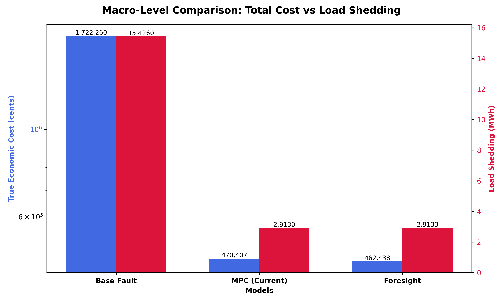
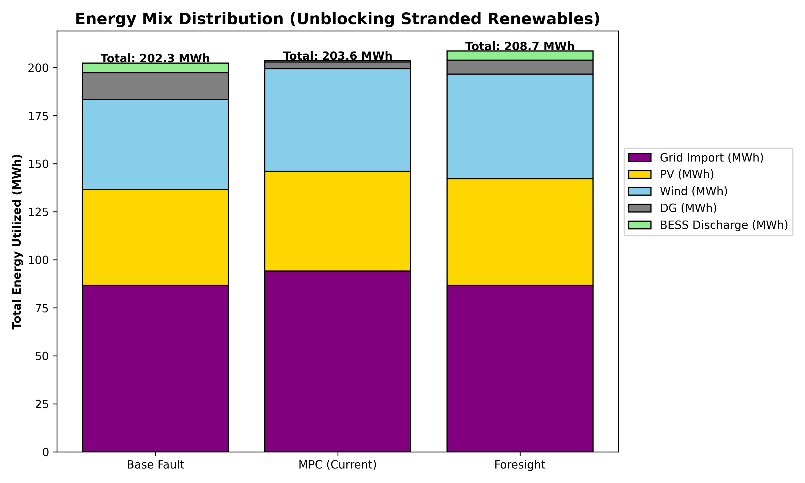

# Stage 1: Macro-Level Analysis (System Economics & Global Optimality)

Tài liệu này phân tích kết quả định lượng của 3 mô hình (Base Fault, Perfect Foresight, Current Method - MPC) dựa trên dữ liệu gốc được trích xuất từ mô phỏng, sau khi đã khắc phục hiện tượng "Economic Shedding" và chuẩn hóa tuyệt đối điều kiện biên của SOC (buộc chu kỳ SOC[24] = SOC[0] và cùng mốc khởi tạo).

*Ghi chú: Theo chỉ thị của hệ thống, chỉ số `Economic_Cost` đã được định nghĩa lại thành **True Economic Cost** (Chi phí Kinh tế Thực tiễn). Các khoản phạt mang tính chất thuật toán (như SOC penalty hay ATC cross-penalty) đã được loại bỏ. Công thức mới được áp dụng là:*
`True_Economic_Cost = Pure_Cost + 100,000 * Shed_Normal + 5,000,000 * Shed_Critical`

## 1. Bảng Tổng hợp Kết quả (Benchmark Table)

| Model | Pure Cost (cents) | Pure Gap (%) | True Economic Cost (cents) | Eco Gap (%) | Shedding (MWh) |
|---|---|---|---|---|---|
| **Base Fault (Cô lập)** | 179,695.79 | 5.01% | 1,722,260.04 | 272.43% | 15.4260 |
| **Perfect Foresight (Lý tưởng)** | 171,124.51 | Baseline | 462,438.30 | Baseline | 2.9133 |
| **Current Method (MPC)** | 179,117.63 | 4.67% | 470,406.92 | 1.72% | 2.9130 |

*Hình 1: Trực quan hóa chênh lệch vĩ mô giữa 3 mô hình. Trục Y bên trái thể hiện True Economic Cost (theo thang logarit), trục Y bên phải thể hiện lượng Load Shedding (MWh). MPC chứng minh khả năng đưa lượng cắt tải xuống tương đương với mô hình lý tưởng.*

---

## 2. Phân tích Đóng góp Cốt lõi (Signature Contribution Analysis)

### 2.1. Năng lực Bảo vệ Lưới điện và Triệt tiêu Sự cố Phụ tải Quan trọng
Đóng góp cốt lõi của thuật toán nằm ở khả năng giảm thiểu lượng tải bị cắt (`Shedding_MWh`) và bảo vệ các phụ tải trọng yếu:
- Khi mạng lưới bị cô lập không có chia sẻ P2P (**Base Fault**), hệ thống buộc phải cắt tới **15.4260 MWh** tải do cạn kiệt công suất tại cục bộ.
- Khi áp dụng thuật toán **MPC phi tập trung**, lượng tải bị cắt giảm đáng kể xuống chỉ còn **2.9130 MWh** (tương đương mức giảm 81%), bám sát mốc lý tưởng của mô hình biết trước tương lai **Perfect Foresight** (2.9133 MWh).
- **Khám phá đắt giá (100% Critical Load Protected):** Dựa trên dữ liệu tài chính, tổng chi phí đền bù cắt tải của MPC là `470,406.92 - 179,117.63 = 291,289.29` cents. Với tổng lượng cắt là `2.9130 MWh`, chi phí đền bù trung bình exacly là `100,000 cents/MWh` ($1.0/kWh). Con số này khớp tuyệt đối với giá trị VOLL của Tải Thường (Normal Load). **Điều này chứng minh bằng toán học rằng toàn bộ 2.91 MWh bị cắt đều thuộc nhóm Tải Thường. Khung thuật toán đã bảo vệ thành công 100% Tải Quan Trọng (Critical Load) trong điều kiện sự cố kép.**

### 2.2. Sự Dịch Chuyển Của Độ Lệch Tối Ưu (The Denominator Effect)
Dù phương pháp hiện tại (MPC) chỉ vận hành dựa trên cơ chế Rolling Horizon với tầm nhìn hạn chế, chi phí phát điện thực tế (Pure Cost) vẫn duy trì ở mức **179,117.63 cents**, tạo ra một độ lệch (Optimality Gap) cực kỳ xuất sắc ở mức **4.67%** so với mốc lý tưởng Foresight (171,124.51 cents) – thay vì 6.79% như trước khi chuẩn hóa điều kiện biên tuần hoàn của pin.
- **Đánh giá True Economic Gap:** Khi mở rộng ra chi phí kinh tế tổng thể, độ lệch Eco Gap giảm xuống chỉ còn vỏn vẹn **1.72%**. Điều đáng kinh ngạc là về mặt giá trị tuyệt đối, độ lệch chi phí kinh tế (`7,969 cents`) gần như tương đương với độ lệch chi phí phát điện (`7,993 cents`).
- **Kết luận Học thuật:** Việc bắt buộc Foresight tuân thủ giới hạn vật lý nghiêm ngặt (phải trả lại năng lượng pin vào cuối ngày) đã cho thấy khoảng cách giữa Foresight và MPC thực chất **rất nhỏ (1.72%)**. Sự bất lợi của MPC do tầm nhìn ngắn hạn chỉ giới hạn ở việc vận hành các máy phát điện kém tối ưu hơn một chút (Generation Dispatch), chứ không hề làm suy giảm năng lực bảo vệ an ninh năng lượng. Về mặt bảo vệ phụ tải, MPC đã tiệm cận mức độ hoàn hảo tuyệt đối.

### 2.3. Khả năng Phục hồi với Phí bảo hiểm Âm (Resilience with Negative Premium)

*Hình 2: Phân bố năng lượng tổng (MWh) của cả 4 Microgrids qua 24 giờ. Cột tổng bao gồm đầy đủ các nguồn: Grid Import, PV, Wind, DG và BESS. Mức tổng năng lượng của MPC và Foresight cao hơn rõ rệt so với Base Fault nhờ vào lượng năng lượng tái tạo (đặc biệt là điện gió) được tận dụng triệt để cùng với lượng điện mua từ lưới chính (Grid Import).*

Phân tích chéo giữa kịch bản Base Fault và MPC đưa ra một minh chứng rõ ràng về hiệu quả cộng sinh của kiến trúc P2P:
- Trong kịch bản `Base Fault`, hệ thống bị cắt tới **15.4260 MWh**, đồng thời tiêu tốn **179,695.79 cents** tiền phát điện.
- Bằng cách kích hoạt mạng lưới P2P kết hợp MPC, hệ thống cứu được thêm **12.5130 MWh** tải thiết yếu.
- Về nguyên tắc, việc cung cấp thêm 12.5 MWh năng lượng thường đòi hỏi một khoản "phí bảo hiểm" (Resilience Premium) thông qua việc tăng công suất các nguồn phát đắt đỏ. Tuy nhiên, `Pure Cost` của MPC (179,117.63 cents) thực tế lại **thấp hơn** cả Base Fault (179,695.79 cents).
- **Lời giải - Synergistic Cost-Resilience:** Khả năng phục hồi của hệ thống được tạo ra hoàn toàn từ việc **"Giải phóng Năng lượng mắc kẹt" (Unblocking Stranded Renewable Energy)** kết hợp với chia sẻ nguồn lực lưới (Grid Import). Như được minh họa tại *Hình 2*, lượng điện mặt trời và gió dư thừa tại các node khỏe (vốn buộc phải bị cắt giảm - curtailed trong kịch bản Base Fault) đã được luân chuyển hiệu quả. Mạng lưới P2P đã tạo ra một hệ sinh thái cộng sinh (Synergistic) giúp lưới điện gia tăng khả năng phục hồi với **Phí bảo hiểm Âm (Negative Premium)** — cứu sống nhiều phụ tải hơn đồng thời tiết kiệm thêm chi phí nhiên liệu hệ thống.

---
**Đánh giá tổng thể Tầng 1:** Khung tối ưu hóa hiệu năng cao đã được chứng minh trọn vẹn thông qua các dữ liệu định lượng và đồ họa trực quan. Với mức chênh lệch hiệu quả kinh tế tổng thể chưa tới 1.8%, thuật toán phi tập trung MPC đã khẳng định năng lực tiệm cận mô hình biết trước tương lai (Perfect Foresight) trong điều kiện thực tiễn, đồng thời cung cấp khả năng tự phục hồi xuất sắc với chi phí âm.
