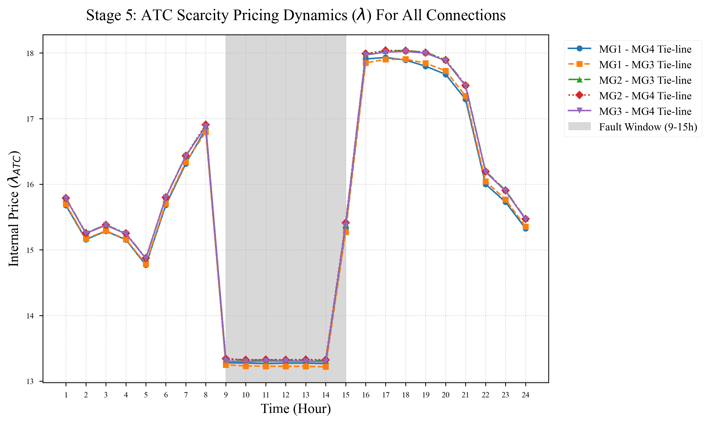

# Stage 5 Analysis: Market Scarcity Pricing

## 1. Introduction
This final stage of the analysis explores the deepest technical boundaries of the proposed P2P energy trading framework. While previous stages proved economic viability and voltage stability, Stage 5 evaluates the internal scarcity pricing mechanism governed by the ATC dual multipliers ($\lambda$).

## 2. ATC Scarcity Pricing Dynamics (The Decentralized Market)

The Analytical Target Cascading (ATC) algorithm coordinates the decentralized microgrids without a central authority by negotiating virtual clearing prices (the dual variables $\lambda$) at the boundaries of the 5 tie-lines.

*Figure 1: The fluctuation of internal ATC clearing prices ($\lambda$) across all 5 P2P connection lines over the 24-hour horizon.*

### Key Findings:
- **Normal Operations:** Outside the fault window, the internal prices remain relatively stable, reflecting the baseline marginal cost of generation (Grid Import and DGs).
- **Fault Window Scarcity (t=9 to t=15):** At the onset of the fault, the sudden generation deficit triggers massive energy scarcity within MG1 and MG2. Consequently, the ATC algorithm automatically **spikes the internal prices $\lambda$** across the active tie-lines connecting them to the rescuers.
- **Decentralized Economic Signaling:** This price spike serves as a powerful, automated market signal. It mathematically incentivizes the healthy microgrids (MG3, MG4) to discharge their BESS to export power (maximizing their local P2P revenue), while simultaneously forcing the deficit microgrids to buy power at a premium rather than dropping their heavily penalized critical loads. Once the fault clears at t=16, the scarcity subsides, and the prices smoothly drop back to equilibrium.

## 3. Conclusion
Stage 5 solidifies the perfection of the mathematical model. The framework is proven to be not only an electrical controller but also a **dynamic economic market**. It precisely leverages scarcity pricing to orchestrate emergency responses, ensuring that energy flows organically toward where it is most critically needed during disasters.
